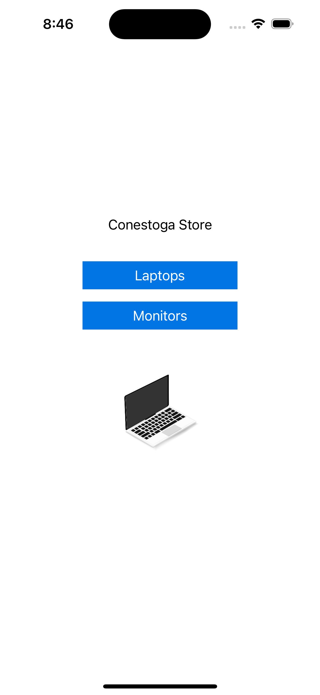
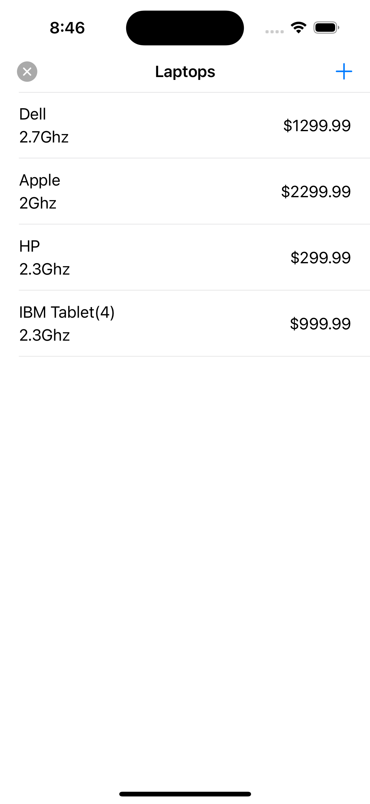
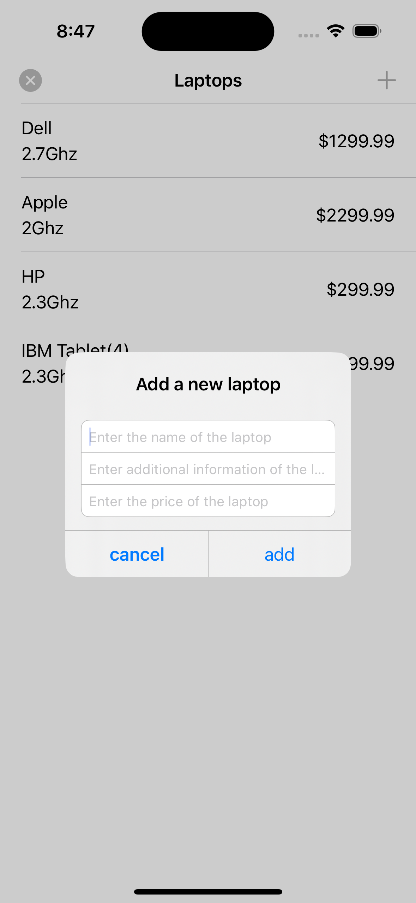
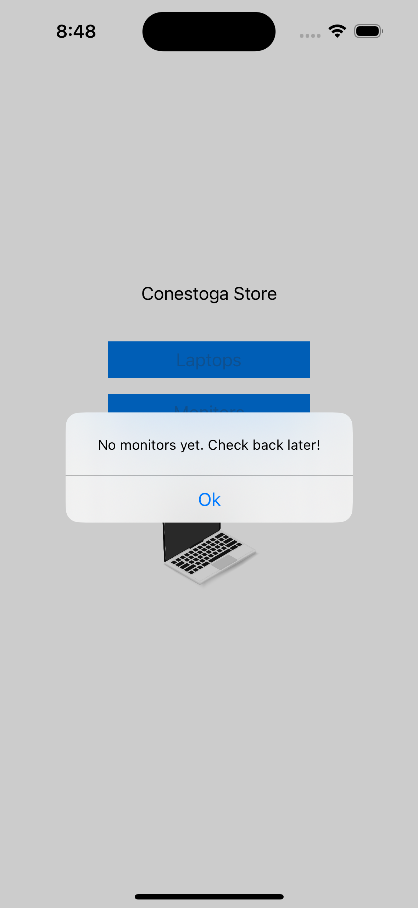
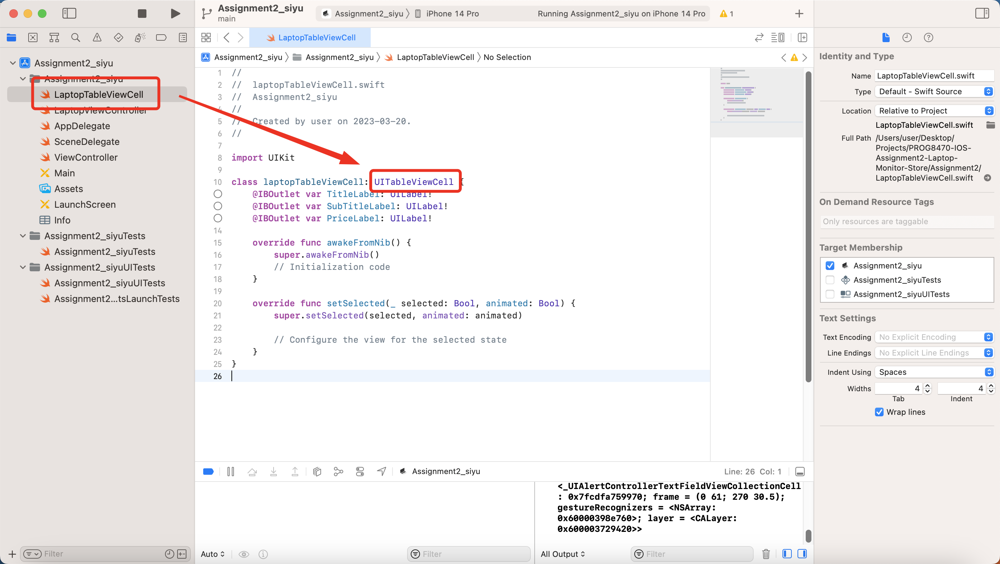
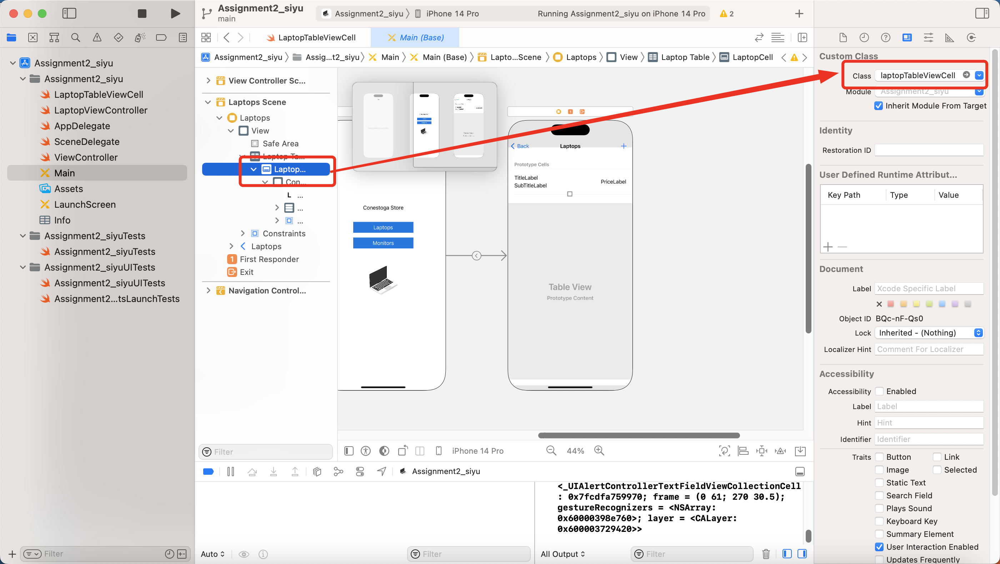
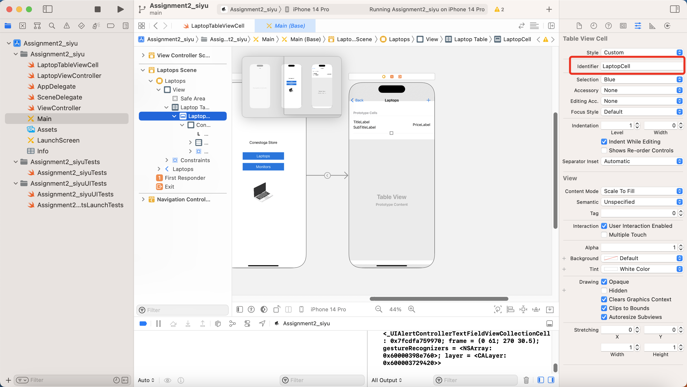
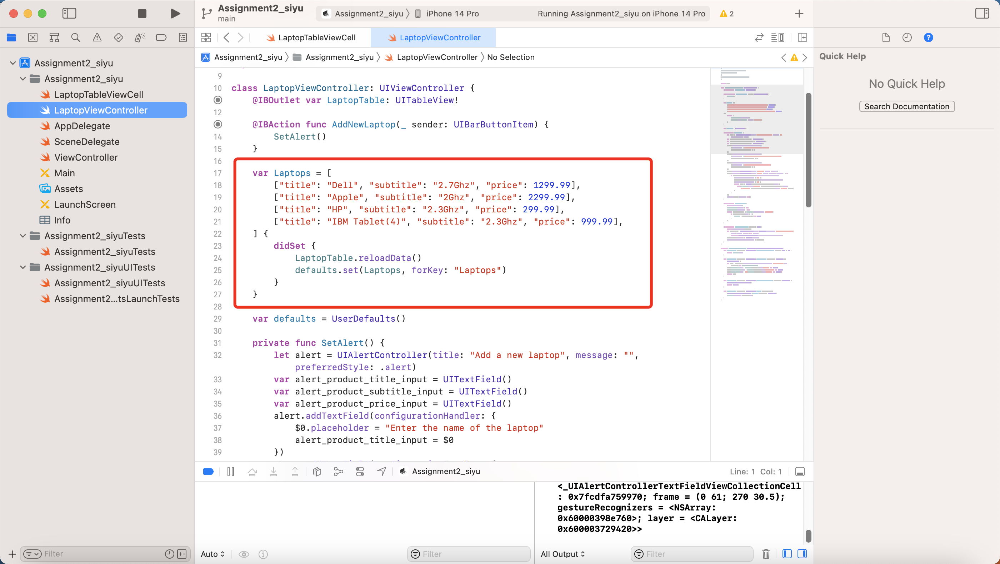
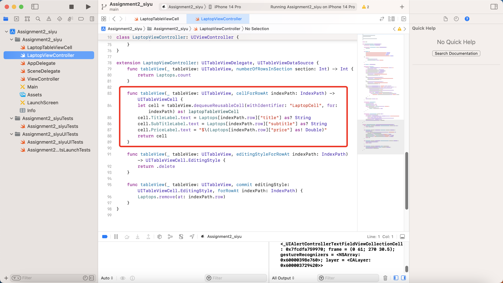

# PROG8470-IOS-Assignment2-Laptop-Monitor-Store

Assignment2 project of PROG8470 IOS development of Conestoga College. This app can add laptop into tableView, but the monitor is unavailable.

## Initial State

## Laptop Table View

Add New Item

## Monitor Alert

## Customized Table Cell

Every table cell of laptop should contain brand, price and basic frequency. This need to create a new class to inherit UITableViewCell class, and keep these three properties.

Replace default UITableViewCell and set a new Identifier

## Bind multi-Layer array with table view

data source array, it contains title, subtitle and price as mapping of the customized properties. 

